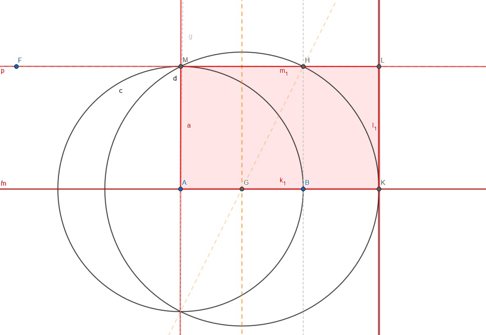

```{r setup, include=FALSE}
knitr::opts_chunk$set(echo = TRUE)
```

# Introducción {#seccion-1}

Este _contenido_ ha sido diseñado por **Manuel Alén Sánchez**.


## La base teórica

Es un ejercicio de optimización básico para determinar las medidas esenciales (base y altura) de una ventana con forma de rectángulo. Necesitamos determinar el metal necesario para rodear la ventana. Dentro de los objetivos y del Plan Nacional Económico se quiere reducir los recursos naturales utilizados,por lo que buscamos minimar la cantidad de metal utilizado. Contamos además con fórmulas como la del área.
$$
[I]  A = b \cdot h
$$

Y el perímetro

$$
P = 2 \cdot b + 2 \cdot h
$$



Para esto, suponemos un rectángulo de un área cualquiera, por ejemplo 180 unidades cuadradas:

$$
180 = b \cdot h
$$

$$
b = \frac{180}{h}
$$

Esta variable la sustituimos en la función del perímetro:

$$
f_{(b,h)} = 2 \cdot (\frac{180}{h}) + 2 \cdot h
$$

$$
f_{(b,h)} = \frac{360}{h} + 2 \cdot h;

$$

$$
f_{(b,h)} = 360 \cdot h^{-1} + 2 \cdot h
$$

El siguiente paso sería realizar la derivada de esta expresión que se nos quedaría:

$$
f_{(b,h)}^{'} = - 360 \cdot h^{-2} + 2
$$

$$
f_{(b,h)}^{'} = 2 - \frac{360}{h^{2}}
$$

Ahora se tiene que buscar el mínimo igualando el resultado de la primera derivada a 0.

$$
2 - \frac{360}{h^{2}} = 0;

$$

$$
2 \cdot h^{2} - 360 = 0
$$

$$
\sqrt{h^{2}} = \sqrt{\frac{360}{2}}
$$

$$
h = \sqrt{180};
$$
Y finalmente, este resultado se sustituye en la expresión del área:
$$
b = \frac{180}{h}
$$

$$
b = \frac{180}{\sqrt{180}}
$$

$$
b = 13,42 unidades cuadradas
$$


$$
h = 13,41 unidades cuadradas
$$

Todo este desarrollo puede simplificarse con código en `R` y que devuelva los valores de la base y la altura que minimicen el perímetro (el metal usado en el marco de la ventana) de una ventana con un área dada.


```{r echo = FALSE, include = FALSE, chunk-1}
library(tidyverse)
library(scales)
library(viridis)
library(plotly)
library(DT)

# Función para calcular el perímetro de un rectángulo
rect_perim <- function(width, height) {
  2 * width + 2 * height
}

# Función para calcular el ancho y alto óptimos del rectángulo para una determinada área
opt_rect <- function(area) {
  # Generar una secuencia de posibles valores de ancho
  widths <- seq(0, sqrt(area), length.out = 1000)
  
  # Calcular la altura correspondiente para cada ancho
  heights <- area / widths
  
  # Calcular el perímetro para cada combinación de ancho y alto
  perims <- rect_perim(widths, heights)
  
  # Encontrar el índice del perímetro mínimo
  min_idx <- which.min(perims)
  
  # Ancho y alto óptimos
  width <- widths[min_idx]
  height <- heights[min_idx]
  
  # Perímetro mínimo obtenido
  perim_min <- perims[min_idx]
  
  # Retorno un data frame con los resultados
  tibble(width = width, height = height, area = area, perim = perim_min)
}

# Generar una secuencia de áreas
areas <- seq(1, 1000, length.out = 100)

# Calcular los valores óptimos de ancho y alto para cada área
results <- map_dfr(areas, opt_rect)


##Estilo 2

library(viridis)

gg_opti <- ggplot(results, aes(x = area, y = perim)) +
  geom_line(color = "white", alpha = 0.8) +
  scale_color_brewer(palette = "Set1") + # Cambiamos el esquema de colores
  labs(title = "Perímetro mínimo de un rectángulo",
       x = "Área", y = "Perímetro") + # Añadimos título y etiquetas de ejes
  theme_minimal() +
  theme(panel.grid = element_blank(), # Quitamos los cuadros del fondo
        panel.background = element_rect(fill = "#f3c561"),
        plot.title = element_text(color = "black", size = 18, face = "bold", hjust = 0.5),
        axis.title = element_text(color = "black", size = 12),
        axis.text = element_text(color = "black", size = 10),
        legend.position = "none") +
  geom_hline(yintercept = min(results$perim), color = "white") +
  geom_vline(xintercept = sqrt(min(results$area)), color = "white")

```

```{r echo = FALSE, tabla-sobrecarga}
datatable(results,
  options = list(
    searchCols = list(
      NULL,
      NULL,
      list(search = 'area'), # reemplaza 'value' por el valor que deseas buscar
      NULL
    )
    )
  )
```

Aquí los resultados graficados:

```{r echo=FALSE, plotly}
ggplotly(gg_opti,tooltip = c("x","y"))
```
